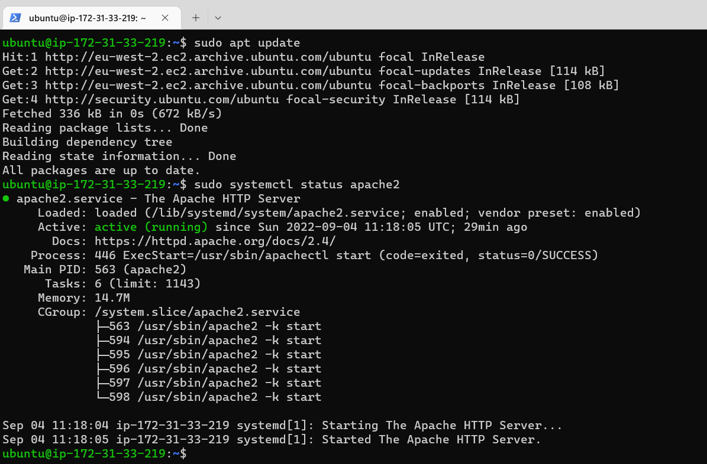
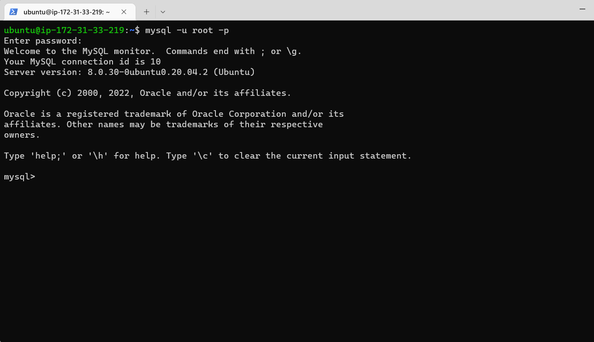
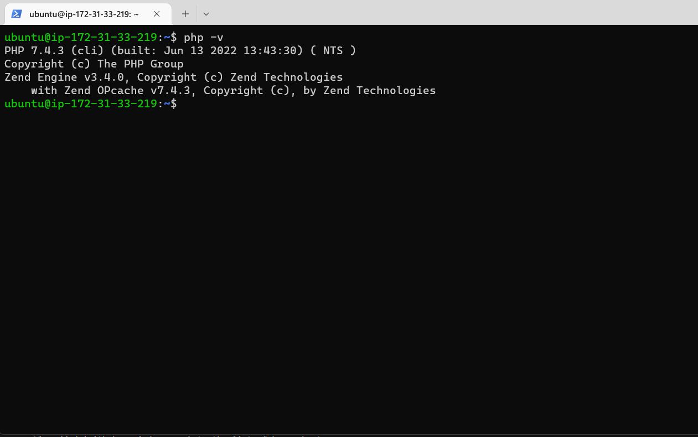
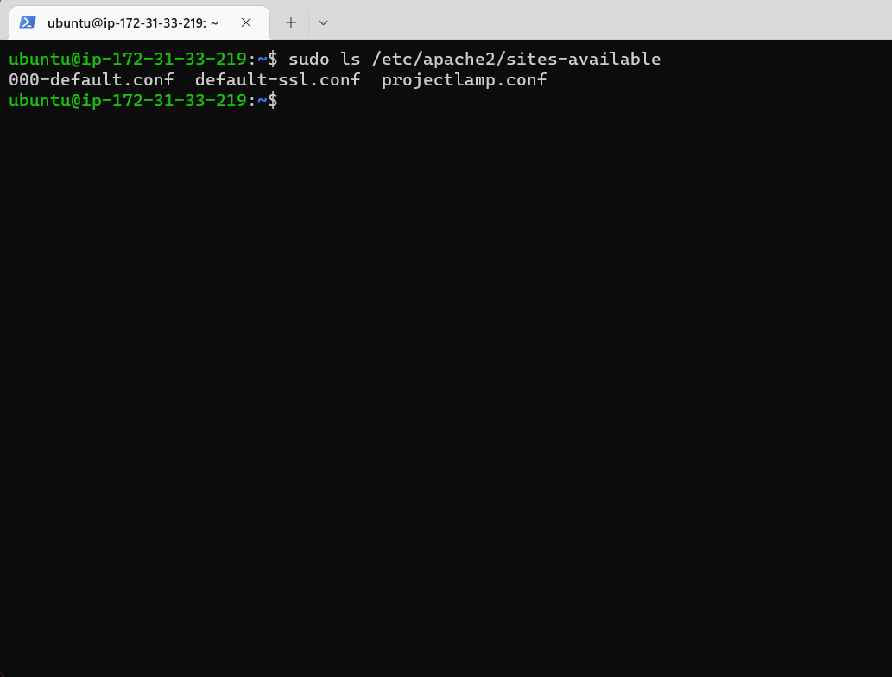
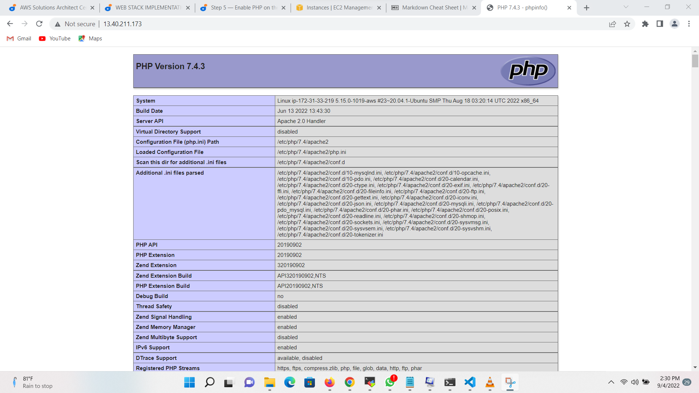

## Documentation of Project 1

# STEP 1: INSTALLING APACHE SERVER
`sudo apt update`
`sudo apt install apache2`
`sudo systemctl status apache2`


# STEP 2 — INSTALLING MYSQL
`sudo apt install mysql-server`
`sudo mysql_secure_installation`
`sudo mysql -p`


# STEP 3 — INSTALLING PHP
`sudo apt install php libapache2-mod-php php-mysql`
`php -v`


# STEP 4 — CREATING A VIRTUAL HOST FOR YOUR WEBSITE USING APACHE
`sudo mkdir /var/www/projectlamp`
`sudo chown -R $USER:$USER /var/www/projectlamp`
`sudo vi /etc/apache2/sites-available/projectlamp.conf`
``` 
<VirtualHost *:80>
    ServerName projectlamp
    ServerAlias www.projectlamp 
    ServerAdmin webmaster@localhost
    DocumentRoot /var/www/projectlamp
    ErrorLog ${APACHE_LOG_DIR}/error.log
    CustomLog ${APACHE_LOG_DIR}/access.log combined
</VirtualHost>
```

`sudo apache2ctl configtest`
`sudo systemctl reload apache2`
``` 
sudo echo 'Hello LAMP from hostname' $(curl -s http://169.254.169.254/latest/meta-data/public-hostname) 'with public IP' $(curl -s http://169.254.169.254/latest/meta-data/public-ipv4) > /var/www/projectlamp/index.html
```

# STEP 5 — ENABLE PHP ON THE WEBSITE

`sudo vim /etc/apache2/mods-enabled/dir.conf`
```
<IfModule mod_dir.c>
        #Change this:
        #DirectoryIndex index.html index.cgi index.pl index.php index.xhtml index.htm
        #To this:
        DirectoryIndex index.php index.html index.cgi index.pl index.xhtml index.htm
</IfModule>
```
`sudo systemctl reload apache2`
`vim /var/www/projectlamp/index.php`
```
<?php
phpinfo();
```

`sudo rm /var/www/projectlamp/index.php`


